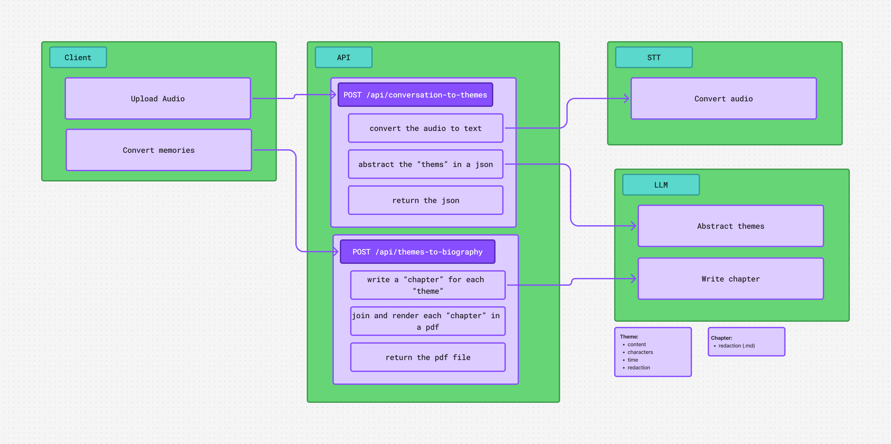

# Epimeteo AI 

📖 **Preservando historias, vidas y memorias.**  
Epimeteo convierte una conversación grabada en una biografía estructurada.

---

## 🧩 Propósito

Muchas historias familiares desaparecen sin ser contadas.  
Epimeteo nace para capturarlas fácilmente, sin necesidad de entrevistas formales ni procesos complejos.

Solo grabas una conversación.  
La aplicación se encarga del resto.

---

## 🎯 Objetivos

- Transcribir conversaciones grabadas separando a los hablantes.
- Organizar el contenido del entrevistado en temas y una línea de vida.
- Generar capítulos y resúmenes con un modelo de lenguaje local.

---

## 🎙️ ¿Qué hace?

Dado un archivo de audio (podcast, grabación móvil, conversación informal), el sistema:

1. **Transcribe la conversación**  
   Reconoce el audio y separa automáticamente los distintos hablantes.

2. **Identifica al entrevistado**  
   Y clasifica sus respuestas como bloques de contenido relevantes.

3. **Agrupa la información en *temas***  
   Cada tema contiene:
   - **Titulo**
   - **Personajes involucrados**
   - **Contexto temporal** (si existe)
   - **Contenido**

4. **Genera una línea de vida**  
   Ordenando cronológicamente los eventos clave.

5. **Transforma los temas en narrativa**  
   Con la ayuda de un modelo de lenguaje local, se redactan:
   - capítulos
   - resúmenes

6. **Exporta el resultado** *(WIP)*  
   - 📘 PDF tipo libro  

---

## Diagrama 



---

## 🧠 Tecnologías

- **Server app**
  - Next.js (React + TypeScript)

- **Speech-to-Text**
  - Whisper (OpenAI)
  - Wrapper Node: https://github.com/ariym/whisper-node  

- **LLM local**
  - Llama 
  - Wrapper Node: https://github.com/withcatai/node-llama-cpp

---

## 🖥️ Equipos

| Equipo   | Función                           | IP            |
|----------|-----------------------------------|---------------|
| Servidor | Ejecuta la aplicación Next.js     | 192.168.1.10  |
| PC01     | Cliente (sube los audios)         | 192.168.1.11  |
| PC02     | Cliente (consulta los resultados) | 192.168.1.12  |

---

## 🛠️ Instalación

Para comprobar que Node.js está instalado, ejecuta `node --version` en el servidor.

```bash
git clone https://github.com/tu-usuario/epimeteo-ai.git
cd epimeteo-ai
npm install
npm run dev
```

---

## ✅ Estado del proyecto

- [x] Transcripción del audio con Whisper
- [x] Agrupación de la información en temas
- [ ] Generación de narrativa con el LLM local
- [ ] Exportación a PDF tipo libro

---

## 🤝 Contribuciones

Ideas, preguntas y feedback son bienvenidos mientras el proyecto evoluciona.

---

## ✍️ Autor

Pedro Fernandez Muñoz  
Alejandro Molina Pallarés
